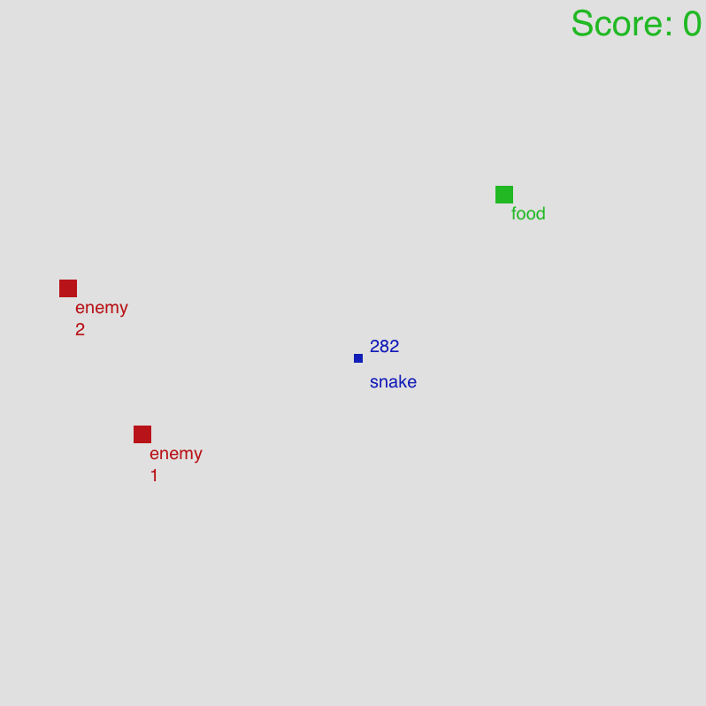

# snakemies
Daniel, Dean and Ross Snake Variant with Enemies and periodic boundaries

Daniel - [danielst0ne](https://github.com/danielst0ne/)
Dean - [ShinkaiSetsuna](https://github.com/shinkaisetsuna/)

Try it out:
[Play Snakemies!](https://mauckc.github.com/snakemies/)


Using:[p5.js](https://p5js.org/)
[source](https://editor.p5js.org/mauckc/sketches/SyjSE8Tqm)

## Reference
[Daniel Schiffman](https://shiffman.net/)
[Snake Game Redux](https://www.youtube.com/watch?v=OMoVcohRgZA)

Basic Snake implementation in p5.js
[editor.p5.js](https://editor.p5js.org/codingtrain/sketches/HkDVpSvDm)

## License
This software is released open-source under the MIT License

## Info

### Controls
#### Movement
##### Arrow Keys
Up, Down, Left, Right

#### Game Control
Reset Button and background color slider:





## Code

### snake.js

#### Constructor
Hunger not currently used but output above snake

```javascript
class Snake {
  
  constructor() {
    this.body = [];
    this.body[0] = createVector(floor(w/2), floor(h/2));
    this.xdir = 0;
    this.ydir = 0;
    this.len = 0;
    this.color = color("#0e0eba");
    this.hunger = 0;
  }
```

#### Set the Snake Direction Function
Takes in vector of updated x and y direction

```javascript
setDir(x, y) {
    this.xdir = x;
    this.ydir = y;
  }
```
#### Update Function
Update the snake every frame
```javascript
  update() {    
    let head = this.body[this.body.length-1].copy();
    this.body.shift();
    head.x += this.xdir;
    head.y += this.ydir;
    this.body.push(head);
    
    // Periodic Boundary Conditions
    if (head.x>=w)
    {
      head.x-=w
    }
    if (head.y>=h)
    {
      head.y-=h
    }
     if (head.x<=-2)
    {
      head.x+=w
    }
    if (head.y<=-2) 
    {
      head.y+=h
    }
  }
```
#### Grow Function
pushes a copy of the current snake head to be added back onto the snake body array

```javascript
grow() {
    let head = this.body[this.body.length-1].copy();
    this.len++;
    this.body.push(head);
  }
  
```

#### Game Over Function
returns true if snake is in bounds of any enemy

```javascript

endGame(enem) {
    let x = this.body[this.body.length-1].x;
    let y = this.body[this.body.length-1].y;

    let enemyxpos = enem.x;
    let enemyypos = enem.y;

    if ( (enemyxpos - 10 < x && x < enemyxpos + 20) && (enemyypos - 10 < y && y < enemyypos+20) ) {
       return true;
    }
    for(let i = 0; i < this.body.length-1; i++) {
    	let part = this.body[i];
      if(part.x == x && part.y == y) {
      	return true;
      }
    }
    return false;
  }
```

```javascript
eat(pos) {
    let x = this.body[this.body.length-1].x;
    let y = this.body[this.body.length-1].y;
    
    if((pos.x <= x && x < pos.x + foodxsize) && (pos.y <= y && y < pos.y + foodysize)) {
      this.grow();
      this.hunger = 0;
      return true;
    }
    // Snake gets hungrier everytime it tries to eat and fails
    this.hunger++;
    return false;
  }
  
  
```

```javascript
show() {
    noStroke();
    fill(this.color);
    // Make text shake with merlin noise with amplitude directly related
    //  to the snake's hunger
    text("snake", this.body[0].x  + 18, this.body[0].y + 20, 50, 50);
    text(this.hunger, this.body[0].x + 18, this.body[0].y - 20, 50, 50);
  	for(let i = 0; i < this.body.length; i++) {
      rect(this.body[i].x, this.body[i].y, 10, 10);
    }
  }
```


### enemy.js
```javascript
class Enemy {

  constructor(index) {
    this.x = floor(random(w));
    this.y = floor(random(h));
    
    this.spawnXDiff = this.x - snake.body[0].x;
    this.spawnYDiff = this.y - snake.body[0].y;

    this.forbiddenRange = 200;
    //check if the enemy is too close to the snake
    if (abs(this.spawnXDiff) < this.forbiddenRange && abs(this.spawnYDiff) < this.forbiddenRange) {
      if (abs(this.spawnXDiff) > abs(this.spawnYDiff)) {
        this.xIsPreferredAxis = true;
      } else this.xIsPreferredAxis = false;
      if (this.xIsPreferredAxis) {
        if (this.spawnXDiff > 0) {
          //wants to move to the right
          if (this.x + this.forbiddenRange < w) {
            //moving to the right
            this.x += this.forbiddenRange;
          } 
          else if (this.spawnYDiff > 0) {
            //tried moving to the right, but ooB. Upwards is preferred.
            if (this.y + this.forbiddenRange < h) {
              //moving up
							this.y += this.forbiddenRange;
            }
            else {
              //tried moving up, but out of bounds, moving downwards.
              this.y -= this.forbiddenRange;
            }
          }
          else {
            //tried moving to the right, but ooB. Downwards is preferred.
            if (this.y - this.forbiddenRange > 0) {
              //moving up
							this.y -= this.forbiddenRange;
            }
            else {
              //tried moving down, but out of bounds, moving upwards.
              this.y += this.forbiddenRange;
            }
          }
        }
        else {
          //wants to move to the left
          if (this.x - this.forbiddenRange > 0) {
            //moving to the left
            this.x -= this.forbiddenRange;
          } 
          else if (this.spawnYDiff > 0) {
            //tried moving to the left, but ooB. Upwards is preferred.
            if (this.y + this.forbiddenRange < h) {
              //moving up
							this.y += this.forbiddenRange;
            }
            else {
              //tried moving up, but out of bounds, moving downwards.
              this.y -= this.forbiddenRange;
            }
          }
          else {
            //tried moving to the left, but ooB. Downwards is preferred.
            if (this.y - this.forbiddenRange > 0) {
              //moving up
							this.y -= this.forbiddenRange;
            }
            else {
              //tried moving down, but out of bounds, moving upwards.
              this.y += this.forbiddenRange;
            }
          }
        }
      }
      else{
        if (this.spawnYDiff > 0) {
          //wants to move up
          if (this.y + this.forbiddenRange < h) {
            //moving up
            this.y += this.forbiddenRange;
          } 
          else if (this.spawnXDiff > 0) {
            //tried moving up, but ooB. right is preferred.
            if (this.x + this.forbiddenRange < w) {
              //moving right
							this.x += this.forbiddenRange;
            }
            else {
              //tried moving right, but out of bounds, moving left.
              this.x -= this.forbiddenRange;
            }
          }
          else {
            //tried moving up, but ooB. left is preferred.
            if (this.x - this.forbiddenRange > 0) {
              //moving left
							this.x -= this.forbiddenRange;
            }
            else {
              //tried moving left, but out of bounds, moving right.
              this.x += this.forbiddenRange;
            }
          }
        }
        else {
          //wants to move down
          if (this.y - this.forbiddenRange > 0) {
            //moving down
            this.y -= this.forbiddenRange;
          } 
          else if (this.spawnXDiff > 0) {
            //tried moving down, but ooB. right is preferred.
            if (this.x + this.forbiddenRange < w) {
              //moving right
							this.x += this.forbiddenRange;
            }
            else {
              //tried moving right, but out of bounds, moving left.
              this.x -= this.forbiddenRange;
            }
          }
          else {
            //tried moving to the down, but ooB. left is preferred.
            if (this.x - this.forbiddenRange > 0) {
              //moving up
							this.x -= this.forbiddenRange;
            }
            else {
              //tried moving left, but out of bounds, moving right.
              this.x += this.forbiddenRange;
            }
          }
        }
      }
    }
    this.speed = floor(random(1, 10));
    this.color = color(186, 14, 14);
    this.direction = 0;
    this.chaseTimer = 0;
    this.index = index;
  }
```

```javascript
// Runs every frame
  update() {
    // Boundary Conditions
    // Check if snake has hit edge of unit boundaries
    if (this.x > w || this.x < 0) {
      if (this.direction == 1) {
        this.direction = 2;
        this.move();
      } else {
        this.direction = 1;
        this.move();
      }
    }
    // Check if Enemy has hit the y boundary of the unit
    if (this.y > h || this.y < 0) {
      if (this.direction == 3) {
        this.direction = 4;
        this.move();
      } else {
        this.direction = 3;
        this.move();
      }
    }
    // Update the x direction
    //this.x = this.x + this.xDir;
    //this.y = this.y + this.yDir;
    if (this.chaseTimer > 60) {
      // Reset chase timer to T-minus 30-90 frames
      this.chaseTimer = floor(random(-30, 30));

      // Calculate distance between enemy and snake head
      this.xDiff = this.x - snake.body[0].x;
      this.yDiff = this.y - snake.body[0].y;
      // Update the enemy direction based on the sign of Diff for x or y
      if (abs(this.xDiff) > abs(this.yDiff)) {
        if (this.xDiff >= 0) {
          this.direction = 1;
        } else {
          this.direction = 2;
        }
      } else {
        if (this.yDiff >= 0) {
          this.direction = 3;
        } else {
          this.direction = 4;
        }
      }
    } else {
      // Iterate chase timer
      this.chaseTimer++;
    }
  }
```

```javascript
  // Custom method for showing the Enemy
  show() {
    fill(this.color);
    noStroke();
    // Enemy text  
    text("enemy " + this.index, this.x + 18, this.y + 20, 50, 50);
    // Enemy body rect(x, y, sizex, sizey)
    rect(this.x, this.y, 20, 20);
  }
```

```javascript
  // Move relative to speed
  move() {
    // Check which way enemy is headed and update the speed
    if (this.direction == 1) {
      this.x = this.x - this.speed;
    } else if (this.direction == 2) {
      this.x = this.x + this.speed;
    } else if (this.direction == 3) {
      this.y = this.y - this.speed;
    } else {
      this.y = this.y + this.speed;
    }
  }
}
```

